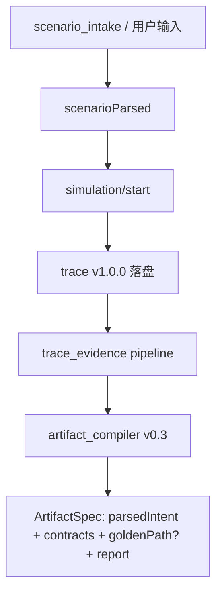

# 数据结构规格：场景想定解析 + 元应用产物

*更新：2026-06-17，ScenarioParsed v2 + ArtifactSpec v0.3.0（无旧字段兼容）*

规范来源：`micro_agent/scenario/schema.py`、`trace_evidence/schemas/artifact_spec_schema.json`、`micro_agent/simulation/artifact_compiler.py`

---

## 一、ScenarioParsed（统一字段名 `scenarioParsed`）

定义：`micro_agent/scenario/schema.py`

### 字段

| 字段 | 类型 | 含义 |
|------|------|------|
| `goal` | string | 核心业务目标（一句话） |
| `description` | string | 完整场景描述 |
| `constraints` | string[] | 约束合集 |
| `acceptanceCriteria` | string[] | 验收标准 |
| `domain` | string | health / aml / aircraft / agriculture / evtol / ecommerce / generic |
| `source` | ScenarioSource? | 证据来源（**仅 trace / 对话 API**，不进 ArtifactSpec 全文） |

### ScenarioSource

| 字段 | 含义 |
|------|------|
| `rawUserInput` | 用户首次原始需求 |
| `intakeDialogue` | `[{role, content}]` 追问对话 |
| `intakeSessionId` | 追问会话 ID |
| `parserModel` | LLM 模型 |
| `parsedAt` | ISO 8601 |

### API 出现位置

| 端点 / 事件 | 字段 |
|-------------|------|
| `POST /api/agent/scenario_intake` ready | `scenarioParsed` |
| `POST /api/simulation/start` | `scenarioParsed` |
| trace 事件 `scenario_parsed` | data = ScenarioParsed dict |
| ArtifactSpec `parsedIntent` | 轻量想定结论（见 §二） |

---

## 二、ArtifactSpec v0.3.0

### 概念边界

| 概念 | 含义 |
|------|------|
| `solidificationReport.solidifiable` | 六道 gate 全过 → **可作固化候选**（最低门槛） |
| `solidificationReport.goldenPathExtractable` | 能否从 trace 抽出**可复用黄金路径**（独立于 solidifiable 语义） |
| `goldenPath` | 最终成功的最小 real_mcp 主干；不可抽取时为 `null` |

### 顶层结构

**核心五字段**（产物交付结论）：

```json
{
  "schemaVersion": "0.3.0",
  "parsedIntent": {},
  "serviceContracts": [],
  "goldenPath": null,
  "solidificationReport": {},
  "artifactMeta": {}
}
```

**结论型附属**（不携带逐步过程明细）：

| 字段 | 说明 |
|------|------|
| `evidence` | 证据检查结论摘要（`evidenceId`、`checkerStatus`、`completeness` 等） |
| `writeBackDraft` | 平台目录回写草稿（派生字段） |

**已删除 / 不再写入产物**：`executionTrace`、`scenario`、`provenance.toolCallProvenance[]`、`parsedIntent` 内完整 `intakeDialogue`。

完整构建过程保留在 `workspace/data/traces/{sessionId}.json`。

### parsedIntent（轻量想定）

| 字段 | 说明 |
|------|------|
| `goal` / `description` / `constraints[]` / `acceptanceCriteria[]` / `domain` | 用户想定结论 |
| `sourceRef.traceRef` | 溯源至 trace（= `sourceSessionId`） |
| `sourceRef.intakeSessionRef` | 追问会话 ID（若有） |
| `sourceRef.parserModel` / `parsedAt` | 解析元数据 |

### serviceContracts

每个参与服务：声明工具 + 实测调用统计（次数、成功率、通道）。

### goldenPath（仅 `solidifiable && goldenPathExtractable` 时非 null）

| 子字段 | 说明 |
|--------|------|
| `sourceTraceRef` | 来源 trace 会话 ID |
| `applicability` | `inputSignature`、`requiredOutputs`、`requiredServices`、`hardConstraints`、`entryGuards` |
| `steps[]` | `stepId`、`toolName`、`contractRef`、`inputBinding`、`outputSlots`、`assertionRefs`、`onFailure` |
| `assertions[]` | L1_structure / L2_dataflow / L3_semantic；`result`: pass \| fail \| unknown |
| `evidenceRefs[]` | 证据 ID + callId 引用 |
| `fallbackPolicy` | 输入不匹配 / 服务不可用 / 工具失败等降级策略 |

抽取来源：最终 PASSED 的 `verifier_result` → `plannerDecision.tool_call_details`（仅 success + real_mcp）。

### solidificationReport

| 字段 | 说明 |
|------|------|
| `solidifiable` | 六道 gate 总结论 |
| `gates[]` | sufficientIterations / verifierPassed / evidenceComplete / noUnresolvedToolErrors / noInfrastructureErrors / realMcpCallsPresent |
| `goldenPathExtractable` | 黄金路径是否可抽取 |
| `goldenPathReason` | 抽取结论说明 |
| `remediation[]` | 修复建议（gate 失败或抽取失败） |
| `conditions` | 各 gate 结构化数值 |

Gate 4（`noUnresolvedToolErrors`）：同 `(serviceId, toolName)` 后续有成功调用 → 前轮失败视为**已修复**，不计入未解决失败。

### artifactMeta

| 字段 | 说明 |
|------|------|
| `artifactId` / `artifactHash` / `traceHash` / `configSnapshotHash` | 溯源指纹 |
| `sourceSessionId` / `traceRef` / `createdAt` | 会话与时间 |
| `appName` / `domain` / `mode` / `appId` | 元应用标识 |
| `evidenceRef` | 证据产物 ID 指针 |
| `intakeSessionRef` | 追问会话指针 |
| `buildSummary` | `totalIterations`、`finalStatus`、`elapsedMs`（摘要，非逐步列表） |

---

## 三、存储分工

| 位置 | 内容 |
|------|------|
| `data/traces/` | 完整 events 流（Planner/Verifier/工具调用/迭代） |
| `data/evidence/` | trace_evidence 检查报告与卡片 |
| `data/artifacts/` | ArtifactSpec v0.3 JSON（结论 + 可选 goldenPath） |

---

## 四、数据流



---

## 五、API

| 方法 | 路径 | 说明 |
|------|------|------|
| GET | `/api/simulation/{id}/artifact` | 编译并返回 ArtifactSpec（优先读已落盘） |
| POST | `/api/simulation/{id}/artifact` | 强制重编译落盘 |
| GET | `/api/simulation/{id}/trace` | 完整 trace（调试 / 轨迹 UI） |
| POST | `/api/simulation/{id}/evidence` | 证据 pipeline |

SSE 仿真结束 `finally` 块自动：save trace → run evidence → compile artifact。
