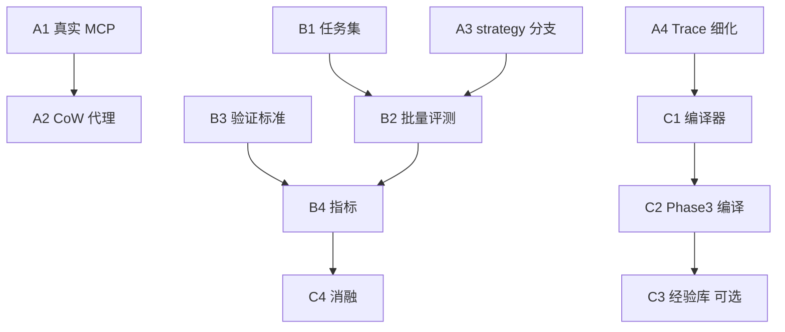

# 仿真构建 · 后续实现路线图

本文记录 **2026-05** 前后仿真模块（`micro_agent/simulation/`）重构之后的**尚未实现**工作与依赖顺序，便于排期与分工。当前已实现：四阶段编排、`SandboxTool` 拟真工具层、双 Agent（Planner/Verifier）、SSE、轨迹持久化（见提交 `dbb0553` 及此前仿真相关提交）。

---

## 1. 当前基线（已实现）

| 能力 | 说明 |
|------|------|
| `SandboxTool` | 与 `MCPTool` 同为 `Tool` 接口；真实延迟、调用日志、按语义推断 JSON 响应 |
| `SimulationOrchestrator` | Phase 0 探测工具、Phase 1 基于已注册工具、Phase 2 双 Agent、Phase 3 从 `call_log` 提取路径与调度草案 |
| 接入真实 MCP | 预期改动点：**仅** `orchestrator._register_tools()`，将 `SandboxTool` 换为 `MCPTool`（或通过代理包装） |

---

## 2. 阶段 A：可跑真实实验

目标：在**真实或准真实**环境下完成单次与多次仿真，策略配置产生**不同行为**。

| ID | 任务 | 主要改动位置 | 要点 |
|----|------|----------------|------|
| **A1** | 接入真实 MCP | `orchestrator._register_tools()` | 参考 `meta_app_agent`：`MCPConnectionManager` / `MCPTool`；`SandboxTool` 作 fallback 或 CI 用 |
| **A2** | CoW 沙箱代理层 | 新建 `micro_agent/simulation/sandbox_proxy.py`（名称可再定） | 读写分类 → 写拦截入沙箱状态 → 读先沙箱再穿透；代理自身实现 `Tool`，替换裸 `MCPTool` 注册 |
| **A3** | `strategy`（M1–M5）真分支 | `SimulationOrchestrator.__init__` 与各 phase | 例：`verification: single_agent` 跳过 Verifier；`sandbox: none` 不代理；`sandbox: full_mock` 仅用 SandboxTool |
| **A4** | Trace 结构细化 | `trace_store.py` + 编排器收尾 | `TraceRecord` 含：`ToolCallRecord` 列表、Verifier verdict、iteration issues，而非仅扁平 SSE 事件 |

**建议顺序**：A1 → A2（若需生产隔离）→ A3 → A4（与持久化 schema 一起定，避免二次迁移）。

---

## 3. 阶段 B：出实验数据

目标：**可批量跑**、**可对比**、指标**可解释**。

| ID | 任务 | 主要改动位置 | 要点 |
|----|------|----------------|------|
| **B1** | 评测任务集 | `data/simulation_tasks/*.json` 或同级目录 | 每条含 `servicesMeta`、`scenarioDescription`、L1–L3 判据 |
| **B2** | 批量评测脚本 | `scripts/run_simulation_eval.py`（新建） | 任务 × strategy 组合；落盘 `TraceRecord`；导出 CSV/JSONL |
| **B3** | 验证标准量化 | `_build_verifier()` 使用的 prompt / 输出 schema | Verifier 按 L1/L2/L3 输出结构化结论，便于与人工标注对齐 |
| **B4** | 指标真实化 | `_collect_metrics()` 及独立分析脚本 | `verificationAccuracy` 等对齐全真/抽样标注；`repairEffectiveness` 来自迭代与 issue 指纹 |

**建议顺序**：B1 → B3（判据先定）→ B2 → B4（指标依赖标注或规则）。

---

## 4. 阶段 C：编译产物与闭环（论文向）

目标：从轨迹到**可部署/可复现**产物，支撑论文 Method 与实验叙事。

| ID | 任务 | 主要改动位置 | 要点 |
|----|------|----------------|------|
| **C1** | 轨迹编译器 | `micro_agent/simulation/compiler.py`（新建） | 输入 `TraceRecord`，输出 `CompiledApp`：`stateSchema`、`executionGraph`、`exceptionHandlers` |
| **C2** | Phase 3 接入编译器 | `_phase_generation()` | `complete.result` 增加 `compiledApp`（与前端契约在 `ioeb/design_docs/build-design4llm.md` 对齐时需核对字段） |
| **C3** | 经验固化 / 记忆 | `micro_agent/simulation/experience.py`（新建）可选 | strategy / recovery / optimization tips；向量检索；Planner 可注入 |
| **C4** | 消融与表格 | `scripts/run_ablation.py`（新建） | M1–M5 单因素消融；输出论文用表格模板 |

**建议顺序**：A4 稳定后 → C1 → C2；C3、C4 与论文截稿并行。

---

## 5. 依赖关系（简图）

若 **A1 推迟**，A3/A4/B1–B4 仍可在 `SandboxTool` 上推进；论文中须注明仿真在受控模拟环境中完成。

---

## 6. 文档与契约

- 前端 / HTTP / SSE 字段：**以 ioeb 仓库** `design_docs/build-design4llm.md` 为准。
- 本仓库代码入口：`micro_agent/simulation/orchestrator.py`、`sandbox_tool.py`、`trace_store.py`、`api/routes/simulation.py`。

---

*更新：2026-05-06*
