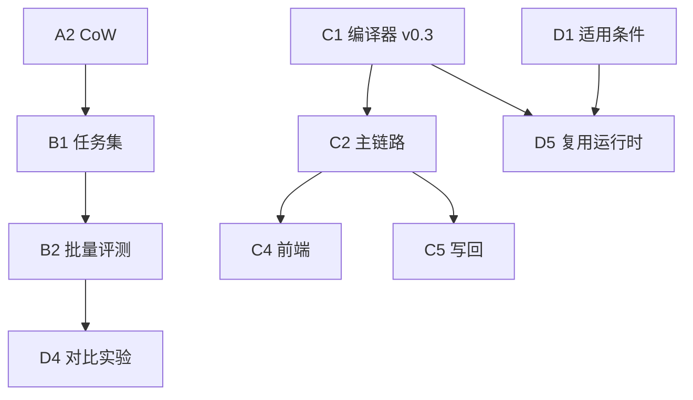

# 仿真构建 · 演进路线图

本文记录 Micro-Agent 仿真与产物链路（`micro_agent/simulation/`、`artifact_compiler`、`trace_evidence`）的**已实现基线**、**尚未完成工作**与依赖顺序。

- **目标与成果缺口**：`GOAL_META_APP_SPEC.md` §8（PPT §7–10 对标）
- **数据结构规格**：`docs/data-structures-spec.md`
- **读写链审计**：`workspace/RECON_META_APP_READ_WRITE_CHAIN.md` §7

*更新：2026-06-17*

---

## 1. 当前基线（已实现）

| 能力 | 说明 |
|------|------|
| `SimulationOrchestrator` | 四阶段编排；Planner + Verifier；启动可复用对话期 `scenarioParsed` |
| **想定追问** | `POST /api/agent/scenario_intake`（grill-me）；ready 返回 `scenarioParsed`（ScenarioParsed v2） |
| Trace v1.0.0 | `tool_call_record` / `planner_decision` / `verifier_result` / `scenario_parsed`；`FileTraceStore` |
| 真实 MCP | `LoggingMCPTool`，`channel=real_mcp`（ioeb `【本地MCP】(n)` 路径） |
| `trace_evidence` | adapter→card→checker→config；仿真结束**自动** `run_pipeline` 落盘 + 手动 `POST /evidence` |
| `artifact_compiler` | trace → **ArtifactSpec v0.3**（`parsedIntent` + `goldenPath?` + `solidificationReport`）；自动落盘 + `GET/POST /artifact` |
| 固化门禁 | 六道 gate；gate 4 支持「失败后被同工具成功调用覆盖」 |
| 黄金路径 | `solidifiable` 后尝试抽取；`goldenPath.assertions` L1–L3 最小实现 |
| API 路由 | `/trace`、`/evidence`、`/artifact`、`/records`；Agent `/scenario_intake` |
| 单测 | `test_artifact_compiler` 22 项 + `test_scenario_intake` 5 项 |

**演示注意**：`课题` 走 ioeb inmemory mock，无真实 trace/evidence/artifact；对外演示用 `【本地MCP】(n)`。

**产物注意**：`data/artifacts/` 仅在仿真成功结束或 `POST /artifact` 时写入；旧版 v0.2 产物已清除，重跑仿真后落盘为 v0.3。

---

## 2. 阶段 A：可跑真实实验

| ID | 任务 | 状态 | 要点 |
|----|------|------|------|
| ~~A1~~ | 接入真实 MCP | **完成** | `LoggingMCPTool` |
| A2 | CoW 沙箱代理层 | 待做 | `sandbox_proxy.py`；M1 本方案 |
| ~~A3~~ | strategy 真分支 | **部分** | sandbox/repair/verification；`preset_workflow` 仍 WARN |
| ~~A4~~ | Trace 结构细化 | **完成** | v1.0.0 结构化事件 |

---

## 3. 阶段 B：出实验数据

| ID | 任务 | 状态 | 要点 |
|----|------|------|------|
| B1 | 评测任务集 | 待做 | `data/simulation_tasks/*.json` |
| B2 | 批量评测脚本 | 待做 | 任务 × strategy → TraceRecord + 导出 |
| B3 | 验证标准量化 | **部分** | `goldenPath.assertions` L1–L3 已落地；批处理对比仍缺 |
| B4 | 指标真实化 | 待做 | 对齐标注或规则 |

---

## 4. 阶段 C：ArtifactSpec 与集成（§7–8 成果）

| ID | 任务 | 状态 | 要点 |
|----|------|------|------|
| ~~C1~~ | ArtifactSpec 编译器 | **完成（v0.3）** | 结论型产物 + 可选 `goldenPath`；无 `executionTrace` |
| C2 | 主链路集成 | **大部分完成** | SSE 结束自动 evidence + artifact；`artifactRef` 写回仍待做 |
| C3 | 中间产物补齐 | **大部分完成** | `parsedIntent`✅、`serviceContracts`✅、`goldenPath`✅、`solidificationReport`✅；`exceptionHandling` 未做 |
| C4 | 前端展示 | **ioeb 已接（跨仓）** | 读 `parsedIntent` / `artifactMeta` / `goldenPath`；兼容旧字段 |
| C5 | 写回 ioeb_backend | 待做 | ServiceApi 新列 + 迁移（见 RECON §4） |

**建议顺序**：C5 → D1/D5（写回与复用）。

---

## 5. 阶段 D：固化依据研究（§10）

| ID | 任务 | 状态 | 要点 |
|----|------|------|------|
| D1 | 适用条件 schema | **部分** | `goldenPath.applicability` v0 已生成；相似度检索 / 完整前置条件仍缺 |
| D2 | 冗余压缩规则 | 待做 | 剪枝失败尝试、合并等价调用（trace 侧仍全量） |
| D3 | 异常处理策略 | 待做 | `fallbackPolicy` 仅为静态默认值，无运行时策略 |
| D4 | 批处理对比 | 待做 | 与 B2 合并：run → compile → compare |
| D5 | 路径复用运行时 | 待做 | `goldenPath` 从数据规格变为可执行配置 |

**建议顺序**：D1 深化 → D5 → D2/D4。

---

## 6. 依赖关系

---

## 7. 近期优先级

| 优先级 | 演进项 |
|--------|--------|
| **P0** | 真实 MCP 构建落盘 v0.3 产物；演示统一 `【本地MCP】` |
| **P1** | C5 写回 ioeb_backend；D5 goldenPath 执行器最小 POC |
| **P2** | B1/B2 批处理；D2 冗余压缩 |
| **P3** | orchestrator 拆分；evidence 三入口收敛 |

---

## 8. 文档体系

| 文档 | 位置 |
|------|------|
| 数据结构规格 | `docs/data-structures-spec.md` |
| 演进路线图 | `docs/simulation-build-roadmap.md`（本文） |
| 目标 + 缺口 | `GOAL_META_APP_SPEC.md` |
| JSON Schema | `trace_evidence/schemas/artifact_spec_schema.json` |
| 运行时数据 | `workspace/data/traces/`、`artifacts/`、`evidence/`（gitignore） |

---

## 9. 代码入口

`orchestrator.py`、`artifact_compiler.py`、`trace_evidence/`、`api/routes/simulation.py`
