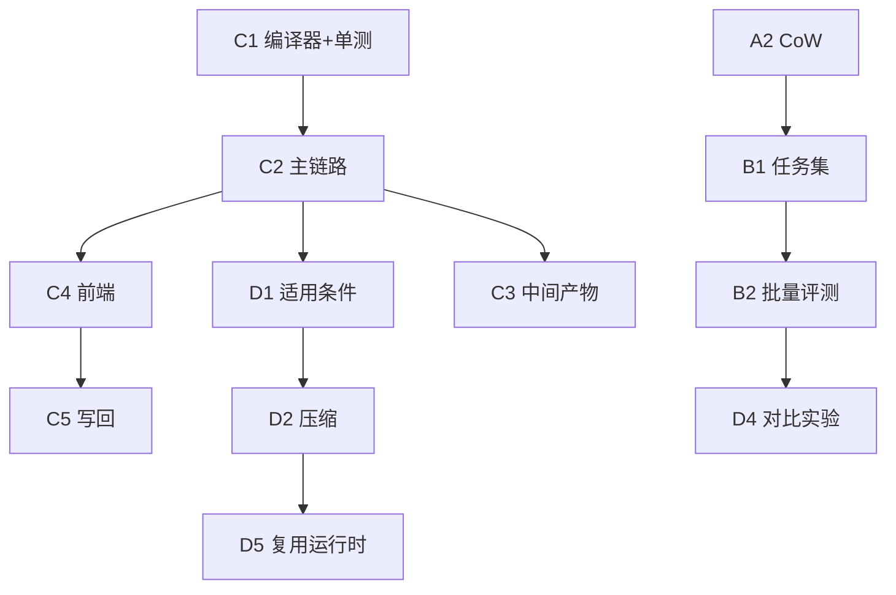

# 仿真构建 · 演进路线图

本文记录 Micro-Agent 仿真与产物链路（`micro_agent/simulation/`、`artifact_compiler`、`trace_evidence`）的**已实现基线**、**尚未完成工作**与依赖顺序。

- **目标与成果缺口**：`GOAL_META_APP_SPEC.md` §8（PPT §7–10 对标）
- **读写链审计**：`workspace/RECON_META_APP_READ_WRITE_CHAIN.md` §7

*更新：2026-06-10*

---

## 1. 当前基线（已实现）

| 能力 | 说明 |
|------|------|
| `SimulationOrchestrator` | 四阶段编排；Planner + Verifier；`verifier_result` 携带 `plannerDecision`；启动可复用对话期 `parsedIntent` |
| **想定追问** | `POST /api/agent/scenario_intake`（grill-me，FileMemory）；`parsedIntent` 契约见 `intent_schema` |
| Trace v1.0.0 | `tool_call_record` / `planner_decision` / `verifier_result` / `scenario_parsed`；`FileTraceStore` |
| 真实 MCP | `LoggingMCPTool`，`channel=real_mcp`（ioeb `【本地MCP】(n)` 路径） |
| `trace_evidence` | adapter→card→checker→config；仿真结束**自动** `run_pipeline` 落盘 + 手动 `POST /evidence` |
| `artifact_compiler` | trace → ArtifactSpec v0 + `solidificationReport`；仿真结束自动编译落盘 + `GET/POST /artifact` |
| API 路由 | `/trace`、`/evidence`、`/artifact`、`/records`；Agent `/scenario_intake`、推荐带 `parsed_intent` |
| 单测 | 111 passed（含 `test_artifact_compiler` 39 项、`test_scenario_intake` 5 项） |

**演示注意**：`课题` 走 ioeb inmemory mock，无真实 trace/evidence/artifact；对外演示用 `【本地MCP】(n)`。

---

## 2. 阶段 A：可跑真实实验

| ID | 任务 | 状态 | 要点 |
|----|------|------|------|
| ~~A1~~ | 接入真实 MCP | **完成** | `LoggingMCPTool` |
| A2 | CoW 沙箱代理层 | 待做 | `sandbox_proxy.py`；M1 本方案 |
| ~~A3~~ | strategy 真分支 | **部分** | sandbox/repair/verification；`preset_workflow` 仍 WARN |
| ~~A4~~ | Trace 结构细化 | **完成** | v1.0.0 结构化事件 |

---

## 3. 阶段 B：出实验数据

| ID | 任务 | 状态 | 要点 |
|----|------|------|------|
| B1 | 评测任务集 | 待做 | `data/simulation_tasks/*.json` |
| B2 | 批量评测脚本 | 待做 | 任务 × strategy → TraceRecord + 导出 |
| B3 | 验证标准量化 | 待做 | L1–L3 结构化断言（§7 状态断言缺口） |
| B4 | 指标真实化 | 待做 | 对齐标注或规则 |

**缺口关联**：B2/B4 对应 §9「可实验、可对比」；批处理接口仍为 **0**。

---

## 4. 阶段 C：ArtifactSpec 与集成（§7–8 成果）

| ID | 任务 | 状态 | 要点 |
|----|------|------|------|
| ~~C1~~ | ArtifactSpec 编译器 | **完成** | `artifact_compiler.py` + schema + `/artifact` + 单测 |
| C2 | 主链路集成 | **大部分完成** | 仿真 SSE 结束自动 evidence + artifact 落盘；`complete` 注入 `sessionId`；`artifactRef` 写回仍待做 |
| C3 | 中间产物补齐 | 进行中 | `parsedIntent`✅（对话 intake + 仿真 `scenario_parsed`）；`serviceContracts`✅；状态断言仍待做 |
| C4 | 前端展示 | **ioeb 已接（跨仓）** | 仿真详情 `/artifact`、`parsedIntent` 编辑、SmartChat 想定追问；prePublish 写回仍待做 |
| C5 | 写回 ioeb_backend | 待做 | ServiceApi 新列 + 迁移（见 RECON §4） |

**建议顺序**：C2 → C4 → C3 → C5；C1 补单测与 P0 并行。

---

## 5. 阶段 D：固化依据研究（§10）

| ID | 任务 | 状态 | 要点 |
|----|------|------|------|
| D1 | 适用条件 schema | 待做 | 输入签名、服务前置条件；**路径复用前提** |
| D2 | 冗余压缩规则 | 待做 | 剪枝失败尝试、合并等价调用 |
| D3 | 异常处理策略 | 待做 | 异常态 → 处理入口 / 重规划策略 |
| D4 | 批处理对比 | 待做 | 与 B2 合并：run → compile → compare |
| D5 | M5 路径复用运行时 | 待做 | `golden_trace` 从标签变为可执行配置 |

**建议顺序**：C 阶段稳定后 → D1 + D2（§10 最小研究闭环）→ D4 → D5。

---

## 6. 依赖关系

---

## 7. 近期优先级（与 GOAL §8.6 对齐）

| 优先级 | 演进项 |
|--------|--------|
| **P0** | ~~C1 单测~~；演示统一 `【本地MCP】` 真链路 + mock 假追问 |
| **P1** | 状态断言；intake  transcript 进 artifact；A2 CoW；B1 任务集 |
| **P2** | D1 + D2；C5 写回；B2 批处理 |
| **P3** | orchestrator 拆分；evidence 三入口收敛；私有方法外泄清理 |

---

## 8. 文档体系

| 文档 | 位置 | 入库 |
|------|------|------|
| 演进路线图 | `docs/simulation-build-roadmap.md` | ✅ 本文 |
| 目标 + 缺口 | `GOAL_META_APP_SPEC.md` | ✅ |
| 读写链审计 | `workspace/RECON_META_APP_READ_WRITE_CHAIN.md` | ✅ |
| 证据管道用法 | `trace_evidence/README.md` | ✅ |
| 基线说明 | `trace_evidence/current/README.md` 等 | ✅ 说明入库；生成物见 `.gitignore` |
| 迭代日志 / 基础设施报告 | `trace_evidence/PROGRESS.md`、`INFRASTRUCTURE_REPORT.md` | ❌ ignore |
| pipeline 输出目录 | `trace_evidence/output*` | ❌ ignore |
| 运行时数据 | `workspace/data/traces/`、`artifacts/`、`evidence/` | ❌ ignore |

HTTP/SSE 字段契约仍以 ioeb `design_docs/build-design4llm.md` 为准（跨仓，不在此维护）。

---

## 9. 代码入口

`orchestrator.py`、`artifact_compiler.py`、`trace_evidence/`、`api/routes/simulation.py`
